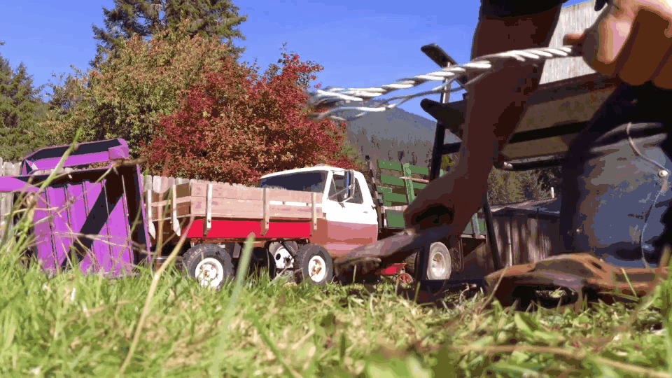

# Deep Homography Estimation for Dynamic Scenes
We address the problem of estimating homography for images with dynamic scenes by introducing a mask-augmented homography estimation network and a dynamics scene video dataset used to train the network. We demonstrate that our dataset enables training deep neural network to better handle dynamic scenes. We also demonstrate that our proposed mask-augmented network dedicatedly designed for these scenes can further improve the performance of homography estimation quantitatively and qualitatively. Should you be making use of our work, please cite our paper.

[[Project]](https://lcmhoang.github.io/publication/2020-cvpr-homography/) Paper

## Overview
"Deep Homography Estimation for Dynamic Scenes"   
[Hoang Le](https://lcmhoang.github.io/), [Feng Liu](http://web.cecs.pdx.edu/~fliu/), Shu Zhang, [Aseem Agarwala](http://www.agarwala.org/) (PSU & Google & Adobe Research)
in IEEE Computer Vision and Pattern Recognition  (CVPR) 2020.

## Dataset 
##### Samples 



<sub>*These sample clips are used under Creative Commons license from Youtube users freestylefactory, RealTDragon, Lumnah Acres, and Wild Bill.*</sub>

This [VideoID and Frame Index](./video_id_and_frame_idx.txt) contains information about the video id and idx of the extracted frame sequences in our dataset. The file is formatted as following:  
```
[youtube_video_id];[frameIdxStart,frameIdxStartEnd];...;[frameIdxStart,frameIdxStartEnd]  
...  
[youtube_video_id];[frameIdxStart,frameIdxStartEnd];...;[frameIdxStart,frameIdxStartEnd]
```

## License and Citation
The provided implementation is for academic purposes only. Should you be making use of our work, please cite our paper.

```
@inproceedings{Le_CVPR_2020,
     author = {Hoang Le, Feng Liu, Shu Zhang, Aseem Agarwala},
     title = {Deep Homography Estimation for Dynamic Scenes},
     booktitle = {IEEE Conference on Computer Vision and Pattern Recognition},
     year = {2020}
}
```

