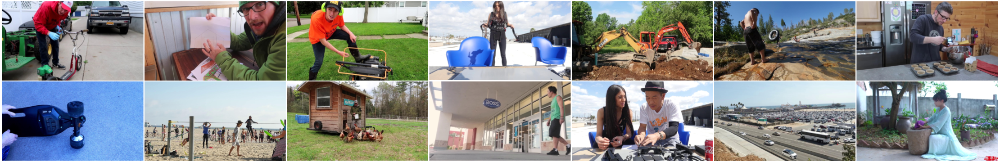

# Deep Homography Estimation for Dynamic Scenes
We address the problem of estimating homography for images with dynamic scenes by introducing a mask-augmented homography estimation network and a dynamics scene video dataset used to train the network. We demonstrate that our dataset is useful to enable training a deep learning based homography estimation to handle dynamic scenes. We also demonstrate that our proposed mask-augmented network dedicatedly designed for these scenes can further improve the performance of homography estimation quantitatively and qualitatively. Should you be making use of our work, please cite our paper [1].

[[Project]](https://lcmhoang.github.io/publication/2020-cvpr-homography/) Paper

## Overview
"Deep Homography Estimation for Dynamic Scenes"   
[Hoang Le](https://lcmhoang.github.io/), [Feng Liu](http://web.cecs.pdx.edu/~fliu/), Shu Zhang, [Aseem Agarwala](http://www.agarwala.org/) (PSU & Google & Adobe Research)
in IEEE Computer Vision and Pattern Recognition  (CVPR) 2020.

## Dataset 

#### Samples 


[Video Link and Frame ID](https://github.com/lcmhoang/hmg-dynamics#dataset)

## Citation

```
@inproceedings{Le_CVPR_2020,
     author = {Hoang Le and Feng Liu},
     title = {Deep Homography Estimation for Dynamic Scenes},
     booktitle = {IEEE International Conference on Computer Vision},
     year = {2020}
}
```

