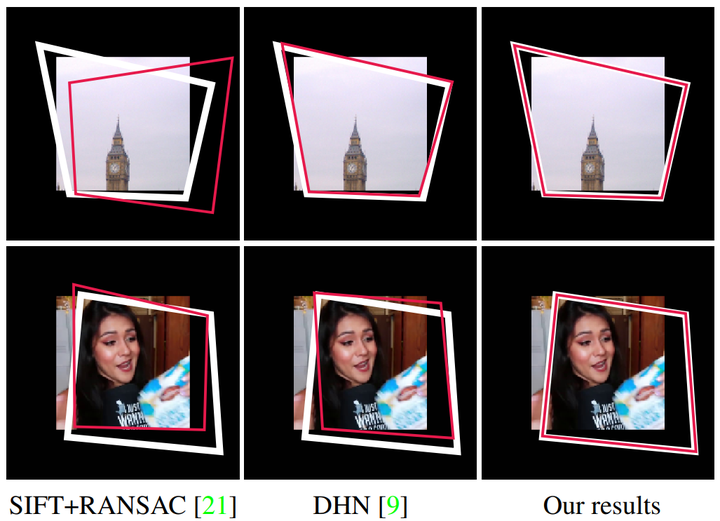

<h1 align="center">Deep Homography Estimation for Dynamic Scenes</h1>
<p align="center">
<a href="https://lcmhoang.github.io/">Hoang Le<sup>1</sup></a>, 
<a href="http://web.cecs.pdx.edu/~fliu/">Feng Liu<sup>1</sup></a>, 
Shu Zhang<sup>2</sup>, 
<a href="http://www.agarwala.org/">Aseem Agarwala<sup>3</sup></a>
<br>
<sup>1</sup>Portland State University, <sup>2</sup>Google, <sup>3</sup>Adobe Research
<br>
<i>IEEE Computer Vision and Pattern Recognition  (CVPR) 2020.</i>
</p>

<figure>
<p align="center" >
  
  <figcaption>
  Fig 1: Challenging examples for homography estimation. Each figure shows one of the two input images. Each white box indicates where the other image in the pair will be warped to in the first image according to the ground truth homography and each red box indicates the result using the estimated homography. As shown in the top row, the lack of texture fails the traditional SIFT+ RANSAC method while the deep learning methods work well. The example at the bottom is difficult as the moving person dominates the image. Compared to both the SIFT-based method and the deep homography estimation method [9], our dynamics-aware method can better estimate homography for a dynamic scene.
  </figcaption>
</p>
</figure>


## Abstract
Homography estimation is an important step in many computer vision problems. Recently, deep neural network methods have shown to be favorable for this problem when compared to traditional methods. However, these new methods do not consider dynamic content in input images. They train neural networks with only image pairs that can be perfectly aligned using homographies. This paper investigates and discusses how to design and train a deep neural network that handles dynamic scenes. We first collect a large video dataset with dynamic content. We then develop a multi-scale neural network and show that when properly trained using our new dataset, this neural network can already handle dynamic scenes to some extent. To estimate homography of a dynamic scene in a more principled way, we need to identify the dynamic content. Since dynamic content detection and homography estimation are two tightly coupled tasks, we follow the multi-task learning principles and augment our multi-scale network such that it jointly estimates the dynamics masks and homography. Our experiments show that our method can robustly estimate homography for challenging scenarios with dynamic scenes, blur artifacts, or lack of textures.

[[Paper]](https://drive.google.com/open?id=1FXgBdr2PwkWY0tbhBTQH1UyqYjyZVl_F)
<a href="https://drive.google.com/open?id=1FXgBdr2PwkWY0tbhBTQH1UyqYjyZVl_F" rel="Paper"></a>

## Dataset 
Training a deep neural network for homography estimation for dynamic scenes requires a dynamic scenes dataset. We introduce here a video collection and a image-pair-generation method to prepare such a dataset. First, we collect a large collection of videos with a *Creative Commons License* from *YouTube* and identify in those videos a set of *static video clips* that capture dynamic scenes while the cameras are held static . This [VideoID and Frame Index](./video_id_and_frame_idx.txt) contains information about the video id and frame index of the extracted static video clips in our dataset. The file is formatted as following:  
```
[youtube_video_id];[frameIdxStart,frameIdxStartEnd];...;[frameIdxStart,frameIdxStartEnd]  
...  
[youtube_video_id];[frameIdxStart,frameIdxStartEnd];...;[frameIdxStart,frameIdxStartEnd]
```

Secondly, we apply our [image_pair_generation.py](./image_pair_generation.py) method to sample a pair of images within each video clip and compute a ground-truth homography between these images to form a training sample.

##### Sample clips capturing dynamic scenes while the cameras are held static


## Acknowledgement
Fig.1 (top) originate from MS-COCO. Fig.1 (bottom) and the dataset sample clips are used under a Creative Commons license from Youtube users Nikki Limo, freestylefactory, RealTDragon, Lumnah Acres, and Wild Bill.


## License and Citation
The provided implementation is for academic purposes only. Should you be making use of our work, please cite our paper.

```
@inproceedings{Le_CVPR_2020,
     author = {Hoang Le, Feng Liu, Shu Zhang, Aseem Agarwala},
     title = {Deep Homography Estimation for Dynamic Scenes},
     booktitle = {IEEE Conference on Computer Vision and Pattern Recognition},
     year = {2020}
}
```

